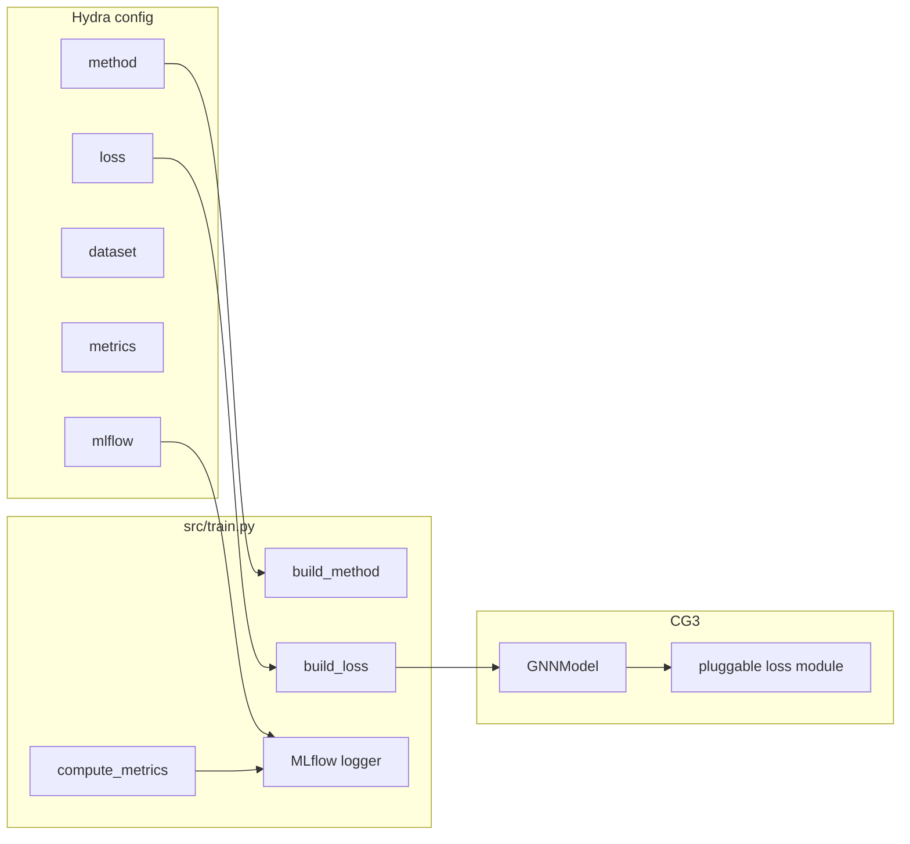

# Direction-2 Hydra Pipeline Scaffolding

Scaffold the Direction-2 experiment pipeline: pluggable contrastive/regularization losses for CG3, heterophilic dataset placeholders, LLM method stubs, a small metrics module (accuracy + F1), and local MLflow tracking wired into the existing Hydra train loop.

## Motivation (from feedback)

The LLM semantic view provides information that may not be captured by the graph structure. The main challenge is how to preserve useful differences in the semantic view while still combining it effectively with the structural views for classification.

- Keep the original contrastive loss between the two structural views in CG3
- Add a disparity or HSIC-based loss to stop the LLM view from becoming too similar to them
- Structural views stay aligned; the semantic view keeps complementary information

## Experiment design

**Main comparison:** whether our method consistently outperforms CG3 and other few-label node classification baselines on:

- Homophilic graphs (Cora, CiteSeer, PubMed — already in the pipeline)
- Heterophilic graphs (placeholders until suitable text-attributed datasets are wired in)

**Case studies / method variants** (not main baselines):

- Directly concatenating LLM embeddings
- Building a k-NN graph from embeddings
- Standard feature fusion

## Goals

1. Swap contrastive / disparity / HSIC losses without rewriting CG3
2. Select homophilic vs heterophilic datasets via config
3. Register LLM case-study methods as stubs
4. Log accuracy, F1, losses, epochs, and config hyperparameters to local MLflow



## 1. Pluggable losses (extract from CG3)

Move the body of `_contrastive_loss` in `src/methods/_cg3/cg3_model.py` into a registry under `src/losses/`:

| File | Role |
|---|---|
| `src/losses/base.py` | `BaseViewLoss.forward(local, global_, ctx) -> Tensor` |
| `src/losses/structural.py` | Original CG3 unsupervised + supervised contrastive |
| `src/losses/disparity.py` | Placeholder (returns 0; for L2/cosine disparity) |
| `src/losses/hsic.py` | Placeholder (returns 0; for HSIC between structural vs semantic) |
| `src/losses/composite.py` | `structural + λ * regularizer` |
| `src/losses/__init__.py` | `LOSS_REGISTRY` + `build_loss(cfg)` |

**Hydra group** `conf/loss/`:

- `structural.yaml` — default; original CG3 contrastive only
- `disparity.yaml` — placeholder
- `hsic.yaml` — placeholder
- `structural_plus_disparity.yaml` / `structural_plus_hsic.yaml` — composites with `lambda_reg`

Wire into CG3 via `loss: structural` in top-level defaults. CLI example:

```bash
python src/train.py method=cg3 loss=structural_plus_hsic
```

## 2. Dataset configs (homo + hetero placeholders)

- Tag Cora / CiteSeer / PubMed with `homophily: true`, `kind: planetoid`
- Add heterophilic placeholders: `roman_empire`, `amazon_ratings` with `homophily: false`, `kind: placeholder`
- Loader dispatches on `kind`; placeholders raise `NotImplementedError` until a real TAG source is wired

## 3. Method placeholders

| Method | Config | Intent |
|---|---|---|
| `cg3` | `conf/method/cg3.yaml` | Working baseline (unchanged behavior) |
| `cg3_semantic` | `conf/method/cg3_semantic.yaml` | Direction-2: CG3 + LLM semantic view + disparity/HSIC |
| `llm_concat` | `conf/method/llm_concat.yaml` | Concatenate LLM embeddings with node features |
| `knn_llm` | `conf/method/knn_llm.yaml` | Build k-NN graph from LLM embeddings |
| `feature_fusion` | `conf/method/feature_fusion.yaml` | Standard feature fusion baseline |

## 4. Evaluation metrics

- `src/eval/metrics.py` + `conf/metrics/default.yaml`
- For now: **accuracy** and **macro F1**
- `BaseMethod.evaluate` returns a dict; train loop logs those keys

## 5. Local MLflow tracking

```yaml
mlflow:
  enable: true
  tracking_uri: sqlite:///mlflow.db
  experiment_name: few-label-gnn
```

Logs flattened Hydra params, per-seed epoch scalars, test accuracy/F1, and aggregate summary metrics.

```bash
uv run mlflow ui --backend-store-uri sqlite:///mlflow.db
```

## Out of scope (scaffolding only)

- Real LLM embedding loading / semantic encoder
- Real HSIC / disparity implementations beyond stubs returning 0
- Real heterophilic dataset download/loaders
- Removing TensorBoard

## Useful commands

```bash
# Baseline CG3
uv run python src/train.py method=cg3 loss=structural dataset=cora label_strategy.budget=20

# Swap in a composite loss (regularizer stub until implemented)
uv run python src/train.py method=cg3 loss=structural_plus_hsic dataset=cora

# Resolve stub method / hetero dataset configs (training raises NotImplementedError)
uv run python src/train.py method=cg3_semantic dataset=roman_empire
```
