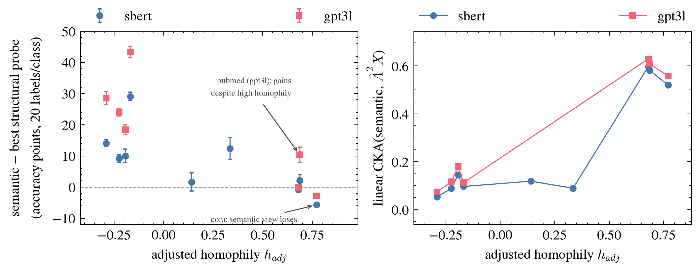

# E5 — semantic probe + CKA across the homophily sweep

| | |
| --- | --- |
| **Date** | 2026-09-06 (preregistered and run the same day) |
| **Chain link** | a |
| **Linear** | FEW-41 (preregistered in FEW-40) |
| **Code** | [`e5_probe_cka.py`](e5_probe_cka.py) — runs against `scaffold/data-and-experiment` @ [`cb48a3a`](https://github.com/Tinnifo/few-label-node-classification-gnn/commit/cb48a3ab9a128554478b3825febc3ee9d2e94f0a) |
| **Compute** | Modal CPU container (8 vCPU, 16 GB), job `4c4fcae1-ac30-46df-a51a-b92aaa955974`, ≈ 1 min |
| **Raw outputs** | [`probe.csv`](probe.csv) · [`cka.csv`](cka.csv) · [`summary.json`](summary.json) · [`run_modal.log`](run_modal.log) |
| **Status** | done — **supported**; link a splits |

## Hypothesis
- **Claim:** on low-homophily graphs the semantic view predicts the label better than the structural inputs, and the two views are least redundant there.
- **Supported if:** (i) semantic probe > best structural probe (X, ²X) on the four WebKB graphs, 20/class, 10 paired seeds, CI excluding 0; and (ii) Spearman(CKA(semantic, ²X), h_adj) > 0 over nine datasets.
- **Not a test of:** CG3's *trained* views (X and ²X are only their inputs) → e5b.

## Prediction (written before the run)
The semantic probe beats structure on heterophilic graphs, and CKA is **lowest** there; on high-homophily graphs the views are redundant and the semantic view adds nothing.

## Setup
LogisticRegression(C=1.0, max_iter=2000), 20/class from the non-test pool, 10 seeds. Views: X, ²X (2-hop symmetric-normalised propagation), `sbert` (384-d), `gpt3l` (3072-d, trio + WebKB). Linear CKA on all nodes. Nine datasets, h_adj −0.29 (texas) → +0.77 (cora).

## Result

| dataset | h_adj | best structural probe | sbert probe (Δ ± CI) | gpt3l probe (Δ ± CI) | CKA sbert·Â²X | CKA gpt3l·Â²X |
| --- | --- | --- | --- | --- | --- | --- |
| texas | -0.29 | prop2 50.3 | 64.4 (+14.1 ± 1.1*) | 78.9 (+28.6 ± 2.0*) | 0.05 | 0.07 |
| cornell | -0.22 | features 54.8 | 64.0 (+9.2 ± 1.2*) | 78.9 (+24.0 ± 1.2*) | 0.09 | 0.12 |
| washington | -0.19 | prop2 62.9 | 72.9 (+10.0 ± 2.2*) | 81.3 (+18.4 ± 1.5*) | 0.15 | 0.18 |
| wisconsin | -0.17 | prop2 42.5 | 71.6 (+29.1 ± 1.4*) | 85.8 (+43.4 ± 1.8*) | 0.10 | 0.11 |
| amazon_ratings | +0.14 | prop2 21.4 | 23.0 (+1.6 ± 2.9) | — | 0.12 | — |
| actor | +0.33 | features 38.7 | 51.1 (+12.4 ± 3.5*) | — | 0.09 | — |
| citeseer | +0.68 | prop2 71.0 | 70.2 (-0.9 ± 0.7*) | 71.0 (-0.1 ± 0.7) | 0.60 | 0.63 |
| pubmed | +0.69 | prop2 72.9 | 75.0 (+2.1 ± 1.9*) | 83.3 (+10.4 ± 2.4*) | 0.58 | 0.61 |
| cora | +0.77 | prop2 80.5 | 74.7 (-5.7 ± 0.7*) | 77.7 (-2.8 ± 0.5*) | 0.52 | 0.56 |

\* CI excludes zero. Accuracy in %, Δ in points. Spearman(CKA, h_adj) = **+0.80 (p = 0.010, n = 9)** for sbert, +0.75 (p = 0.052, n = 7) for gpt3l.

## Predicted vs actual

| | Predicted | Actual |
| --- | --- | --- |
| semantic − structural probe on WebKB | > 0, CI excludes 0 | **+9 … +43 pts, all four graphs** |
| CKA ordering vs h_adj | lowest on WebKB; Spearman > 0 | **WebKB 0.05–0.18, trio 0.52–0.63; +0.80 / +0.75** |
| high homophily: nothing to add | redundant | cora loses (−5.7 / −2.8); citeseer level; **pubmed gains +10.4 (gpt3l)** |

## What it changes
Link **a** is alive and **splits**: a₁ (the semantic view carries label information structure lacks, tracking low homophily) — supported; a₂ (the *size* of the gain also depends on how weak the structural signal is — pubmed) — open.
Caveats: against structural *inputs*, not CG3's trained views (→ e5b); encoder pre-training contamination (a′) not controlled — audit before repeating the WebKB gpt3l numbers.
