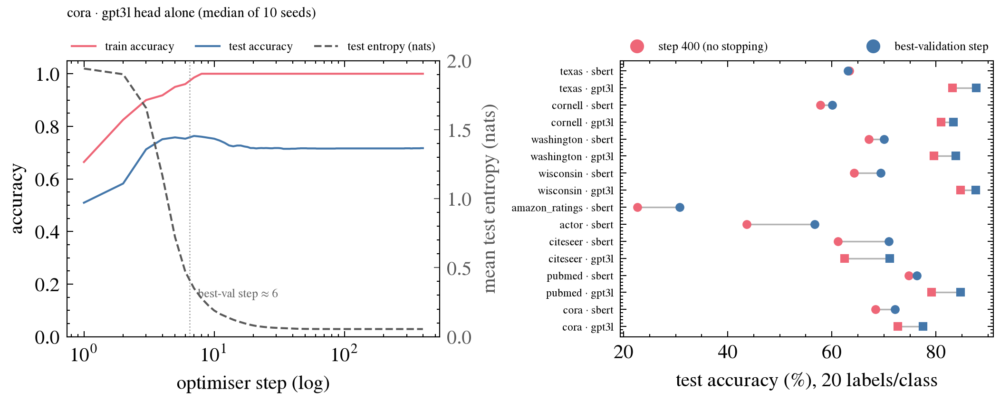

# E6 — does the semantic MLP head, trained alone, memorise the 140 labels?

| | |
| --- | --- |
| **Date** | 2026-09-06 (preregistered and run the same day) |
| **Chain link** | c |
| **Linear** | FEW-42 (preregistered in FEW-40) |
| **Code** | [`e6_head_alone.py`](e6_head_alone.py), [`modal_run.sh`](modal_run.sh) — against `scaffold/data-and-experiment` @ [`cb48a3a`](https://github.com/Tinnifo/few-label-node-classification-gnn/commit/cb48a3ab9a128554478b3825febc3ee9d2e94f0a) |
| **Compute** | Modal CPU container (8 vCPU, 16 GB), job `4c4fcae1-ac30-46df-a51a-b92aaa955974`, ≈ 24 min |
| **Raw outputs** | [`summary.json`](summary.json) · [`run_modal.log`](run_modal.log) (per-step curves, 8 MB, not committed) |
| **Status** | done — **supported**; link c dead as stated → re-stated |

## Hypothesis
- **Claim:** the pipeline's semantic head (Linear(d,256)–ReLU–Linear(256,128)–Linear(128,C), Adam lr 0.01, no weight decay / dropout / early stopping) reaches train accuracy 1.0 within tens of steps; test accuracy plateaus while test entropy keeps falling.
- **Supported if:** median step-to-train-acc-1.0 ≤ 100 everywhere, and test entropy at step 400 < entropy at the plateau on ≥ 7/10 seeds.

## Prediction (written before the run)
Train accuracy 1.0 within about 40–50 steps.

## Setup
400 full-batch steps on the 20/class train nodes; logs train/test/val accuracy and test mean entropy each step; 10 seeds; nine datasets; sbert (all) and gpt3l (trio + WebKB) → 16 heads.

## Result

| dataset | encoder | step train-acc = 1.0, median [IQR] | best-val step | test acc @400 | test acc @best-val (Δ) | test entropy: plateau → 400 |
| --- | --- | --- | --- | --- | --- | --- |
| texas | sbert | 12 [11–14] | 4 | 63.4 | 63.1 (-0.3) | 0.56 → 0.13 |
| texas | gpt3l | 9 [8–11] | 9 | 83.2 | 87.8 (+4.6) | 0.69 → 0.05 |
| cornell | sbert | 8 [8–9] | 5 | 57.8 | 60.1 (+2.3) | 1.28 → 0.08 |
| cornell | gpt3l | 7 [7–8] | 8 | 81.0 | 83.3 (+2.3) | 0.52 → 0.05 |
| washington | sbert | never (max 0.98) | 6 | 67.1 | 70.0 (+2.9) | 0.94 → 0.12 |
| washington | gpt3l | never (max 0.98) | 8 | 79.6 | 83.8 (+4.2) | 0.83 → 0.08 |
| wisconsin | sbert | 9 [9–10] | 9 | 64.3 | 69.3 (+5.0) | 0.93 → 0.10 |
| wisconsin | gpt3l | 10 [9–11] | 10 | 84.7 | 87.7 (+3.0) | 0.65 → 0.07 |
| amazon_ratings | sbert | 13 [12–16] | 6 | 22.7 | 30.7 (+8.1) | 1.46 → 0.23 |
| actor | sbert | 14 [14–16] | 8 | 43.6 | 56.7 (+13.1) | 1.25 → 0.17 |
| citeseer | sbert | 10 [9–10] | 4 | 61.2 | 70.9 (+9.7) | 1.64 → 0.07 |
| citeseer | gpt3l | 7 [7–7] | 3 | 62.5 | 71.1 (+8.7) | 1.50 → 0.06 |
| pubmed | sbert | 6 [5–7] | 7 | 74.7 | 76.3 (+1.6) | 0.79 → 0.03 |
| pubmed | gpt3l | 5 [5–6] | 6 | 79.2 | 84.7 (+5.5) | 0.54 → 0.03 |
| cora | sbert | 10 [9–10] | 6 | 68.4 | 72.1 (+3.8) | 1.29 → 0.07 |
| cora | gpt3l | 8 [7–8] | 6 | 72.7 | 77.5 (+4.8) | 1.28 → 0.06 |

Entropy falls after the plateau on 10/10 seeds for every head.

## Predicted vs actual

| | Predicted | Actual |
| --- | --- | --- |
| step to train acc 1.0 (cora, sbert) | ≈ 40–50 | **10** [9–10]; gpt3l 8 |
| test entropy after the plateau | keeps falling | **1.29 → 0.07**, 10/10 seeds, same shape on all 16 heads |

## What it changes
Link **c** is dead as stated: the head memorises within ~10 steps, and everything trained so far with this head fused a fully memorised semantic view. Stopping at the best-validation step is worth +2 … +13 pts on 15 of 16 heads.
Re-stated link: *the semantic head is stopped/calibrated on validation labels, and those labels are counted in the budget.* Test: FEW-35. Link d (fusion collapse) cannot be tested on the current head until c's fix lands.
